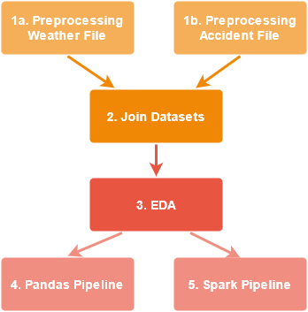

# Big-Data-Analytics-Group-Project
Welcome to the repository of group 23 for the course 'Big-Data Analytics' in FS 21. Our team members are: Alexander Wyss, Andrea Meier, Anton Schwarz, Maximilian Weber and Michael Nadig .

In our project we try to predict the possibility of car accidents in the town of Zurich based on weather data. 

## Structure of Repository
In the following you can see the structure of our repository: 

## Data Collection
The data for our work we got from [Open Data Zurich](https://www.stadt-zuerich.ch/opendata.secure.html). We used two files: 
* [RoadTrafficAccidentLocations.csv](https://data.stadt-zuerich.ch/dataset/sid_dav_strassenverkehrsunfallorte) which provides the police-registered road traffic accidents with personal injury and property damage in the Zurich city area since 2011. And
* [messwerte_mythenquai_2007-2020.csv](https://data.stadt-zuerich.ch/dataset/sid_wapo_wetterstationen) which  provides measured values for both current and past weather situations.

## EDA
After we have gathered our data we had a first look at it to familarize. We wanted to find out about things like what are the max, min and average values of our variables. How many accidents event do we have compared to non-accident events? What are the monthly averages for accident or air temperature? How are our accidents distributed during the day? etc. All the plots can be found in the [EDA notebook](https://github.com/Antonio-226/Big-Data-Analytics-Group-Project/blob/main/EDA.ipynb).
## Data Processing
In a first step we needed to prepare the two datasets for the later join. This included deriving the date from weekday, month and year information in the accidents datasets and accumulating the weatherdata to the same time interval as the accident data. To get a more detailed description and find out more about all preprocessing steps see the files [Preprocessing_Accidents.ipynb](https://github.com/Antonio-226/Big-Data-Analytics-Group-Project/blob/main/Preprocessing_Accidents.ipynb) or [Preprocessing_Weather.ipynb](https://github.com/Antonio-226/Big-Data-Analytics-Group-Project/blob/main/Preprocessing_Weather.ipynb) respectively.

In a second step we join the two datasets. There are two different joins that can be used for different types of predictions. 
* The first join (A) can be used to predict wheter an accident is likely to occour according to the weather conditions. It is a left outer join on the weather data, meaning that there are weather records that are not connected to accidents.
* The second join (B) joins accidents with the weather conditions present at the time of the accident. With this data we can do multiclass prediction and predict the severity category of an accident. As we only have accident conditions in this datafile we can also make use of further information such as the accident location, which we do not have if we only use the weather data for prediction.

## Data Processing in OpenRefine

After we have joined the datasets we made some further processing in OpenRefine. The specific steps are documented below:

* Removed unnecessary columns (3 languages, days, moths, hours, column number, etc.)
* Transformed date column ToDate
* Removed AccidentUID - Ran Duplicates facet on it --> no duplicates (false 48017)
* Removed CantonCode because everything from canton ZH
* Removed MuicipalityCode - Always 261
* Remove rows after 2019 because weather doesn't have more entries
* air_temp to numeric value --> numeric facet --> removed all blank rows
weather values to numeric values

## Modeling
To build the models for the predictions, we used a two-part approach. On one hand we continued using jupyter notebooks and familiar libraries like pandas, sklearn and pytorch. On the other hand we tried to implement he whole pipeline in Spark. 

### Pandas pipeline
In this pipeline we tried out several models for prediction. We also tried several prediction variables. All the models can be found in [Classification.ipynb](https://github.com/Antonio-226/Big-Data-Analytics-Group-Project/blob/main/Classification.ipynb). The following types of models had been used:
* Binary Classification
    * Neural Network
    * Random Forest
* Multi-Class Classification
    * Neural Network (Prediction of AccidentSeverity)
    * Random Forest (Prediction of AccidentType)

The bests results we achieved with __...TO BE CONTINUED...__

### Spark pipeline
In this notebook ([Spark.ipynb](https://github.com/Antonio-226/Big-Data-Analytics-Group-Project/blob/main/Spark.ipynb)) we tried to implement as much of te previously described steps into Spark. Originally we planed to try out the streaming module but the set up turned out to be too complicated. Therefore we decided that we will do a proof of concept to show that we understand how to transfer the steps we have been done to Spark. However we noticed that for our project it is more efficient to do the calculations with pandas.

## Conclusion
In this project we have gone through the whole pipleline of a Data Science project. We started by searching for suitable data sources to aggregating, cleaning and processing the data until we finally built our models.

We have found severl issues that we think could be improved for an real world application:

First, we have seen that Spark might not be the right tool to use for such a small project. While we have shown that the steps we have done with pandas can also be accomplished in Spark, the calculation effort is much higher if Spark is only used on a single machine.

Second, our models are not of a great use yet. Our assumption that the accidents depend on the weather alone was perhaps a bit naive. For further improving the models we would propose to include further datasets with additional information. One such dataset might be about traffic counts [e.g. Open Data Zurich](V).

 
 

